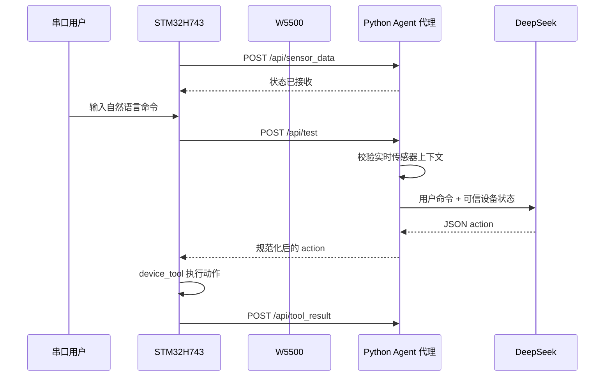

# 系统架构

## 目标

IOT_Agent 将 STM32H743 作为实时设备端，将本地 Python 服务作为网络和模型代理。
设备端负责采集、实时控制和动作执行；代理端负责 HTTP 接口、状态校验、上下文组织以及云端模型访问。

## 数据链路

## STM32 端职责

`App/Src/FreeRTOS_Demo.c` 当前创建以下主要任务：

| 任务 | 职责 |
| --- | --- |
| UART 任务 | 接收串口命令并提交给 Agent 服务 |
| W5500 任务 | 初始化网络、维护链路并完成 HTTP 交互 |
| 光照任务 | ADC 采样、8 点滤波、等级判断和 LED 控制 |
| 温度任务 | ADC 采样、8 点滤波、等级判断和风扇控制 |
| 人体任务 | PIR 预热、稳定采样、保持时间和状态发布 |

`App/Src/device_tool.c` 将模型动作映射到 LED、风扇和蜂鸣器 GPIO，
并提供设备实际状态查询。`App/Src/http_client.c` 在 W5500 Socket 0 上实现当前业务所需的 HTTP GET/POST。

## Python 代理职责

`http_test/post_server.py` 提供三个核心边界：

1. 校验 STM32 上报的数据类型、取值范围和状态字段。
2. 将最近一次有效设备状态作为可信上下文，与用户文本分开组织。
3. 规范化模型输出，只把设备端支持的动作返回给 STM32。

代理还提供 `/dashboard`，用于观察设备在线状态、光照、温度、人体状态和输出设备状态。

## 设计取舍

- STM32 不直接处理 TLS 和云端 API 鉴权，减少嵌入式端内存与协议复杂度。
- SPI 和 ADC 当前采用阻塞式轮询，便于第一阶段验证和排障。
- 传感器数据由设备主动上报，Agent 处理实时问题时检查数据是否有效和过期。
- 温度值在完成标定前始终按 ADC 值表达，避免把未标定数据误报为摄氏温度。

## 后续演进

- 把固定 IP、端口和传感器阈值移到统一配置模块。
- 为网络重连、HTTP 错误和任务栈余量增加可观测指标。
- 根据吞吐需求评估 SPI DMA，并同步设计 Cortex-M7 D-Cache 一致性策略。
- 为模型动作增加更明确的协议版本和设备能力协商。
