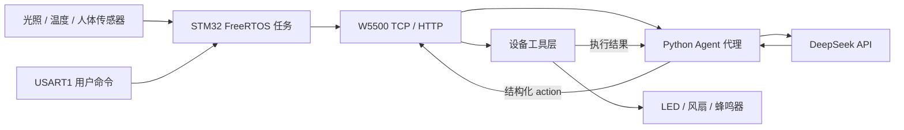

# IOT_Agent

基于 STM32H743、FreeRTOS、W5500 和云端大模型的嵌入式 AI Agent 终端。
项目从 RTOS 最小验证开始，逐步完成以太网通信、本地 Agent 模拟、
DeepSeek 接入、设备执行闭环和多传感器可信上下文。

当前版本：`v0.6.0-sensors`

## 已实现能力

- 手动移植 FreeRTOS，运行网络、串口及传感器任务。
- 使用 SPI1 驱动 W5500，完成版本寄存器、链路、TCP 和 HTTP 通信。
- 通过 USART1 输入中文命令，并接收 Agent 返回的结构化动作。
- 将 LED、风扇和蜂鸣器封装为可执行设备工具。
- 采集光照、温度 ADC 和人体感应数据，完成滤波、状态判断和周期上报。
- Python 代理校验设备遥测，将可信实时状态注入 DeepSeek 上下文。
- 在执行模型动作后，将设备执行结果回传给服务端。

## 系统架构



更详细的数据流和任务职责见 [Docs/architecture.md](Docs/architecture.md)。

## 技术栈

| 分类 | 选型 |
| --- | --- |
| MCU | STM32H743ZIT6 / Cortex-M7 |
| RTOS | FreeRTOS Kernel，手动移植 |
| 网络 | W5500，SPI1，IPv4/TCP/HTTP |
| 外设 | USART1、ADC1、ADC3、GPIO |
| 云端模型 | DeepSeek Chat API |
| 本地服务 | Python 3 `ThreadingHTTPServer` |
| 工具链 | STM32CubeMX、Keil MDK-ARM |

## 工程结构

```text
IOT_Agent/
|-- App/          FreeRTOS 任务、HTTP 客户端、Agent 与设备逻辑
|-- BSP/          W5500 和传感器板级驱动
|-- Core/         STM32CubeMX 生成的初始化及中断代码
|-- Drivers/      STM32 HAL 与 CMSIS
|-- ThirdParty/   FreeRTOS Kernel
|-- http_test/    本地 HTTP/DeepSeek 代理和状态面板
|-- Docs/         架构、硬件连接与阶段记录
`-- MDK-ARM/      Keil 工程文件
```

## 快速开始

### 1. 编译固件

1. 安装 Keil MDK-ARM 和 STM32H7 Device Family Pack。
2. 打开 `MDK-ARM/IOT_Agent_User.uvprojx`。
3. 选择 `IOT_Agent_User` Target，执行 Build。
4. 使用 ST-Link 下载到 STM32H743ZIT6。

最近一次本地 Keil 构建结果为 `0 Error(s), 2 Warning(s)`。

### 2. 配置本地网络

当前示例使用静态地址：

| 节点 | 地址 |
| --- | --- |
| STM32 + W5500 | `192.168.1.123/24` |
| Python Agent 服务 | `192.168.1.100:8080` |
| 网关 | `192.168.1.1` |

电脑网卡需要配置到同一网段。修改网络参数时，请同步检查
`BSP/Src/W5500.c` 和 `App/Src/FreeRTOS_Demo.c`。

### 3. 启动 Agent 服务

API Key 仅通过环境变量提供，不写入仓库。

PowerShell：

```powershell
cd http_test
$env:DEEPSEEK_API_KEY = "<your-api-key>"
python post_server.py
```

CMD：

```bat
cd http_test
set DEEPSEEK_API_KEY=<your-api-key>
python post_server.py
```

启动后可访问 `http://127.0.0.1:8080/dashboard` 查看最近一次设备状态。

### 4. 连接调试串口

当前 USART1 使用 `PA9=TX`、`PA10=RX`，参数为 `115200 8N1`、无硬件流控。
USB-TTL 需要交叉连接 TX/RX，并共地；电平使用 3.3 V。
详细接线见 [Docs/hardware.md](Docs/hardware.md)。

## HTTP 接口

| 方法 | 路径 | 用途 |
| --- | --- | --- |
| `GET` | `/api/status` | 获取最近一次设备与传感器状态 |
| `GET` | `/dashboard` | 浏览器状态面板 |
| `POST` | `/api/test` | 提交用户命令并获取 Agent 动作 |
| `POST` | `/api/sensor_data` | STM32 周期上报传感器状态 |
| `POST` | `/api/tool_result` | STM32 回传动作执行结果 |

## 阶段版本

| 版本 | 日期 | 阶段成果 |
| --- | --- | --- |
| `v0.1.0-freertos` | 2026-06-30 | FreeRTOS 工程规范化与最小任务验证 |
| `v0.2.0-w5500` | 2026-07-01 | W5500 Ping、TCP 和 HTTP GET 验证 |
| `v0.3.0-local-agent` | 2026-07-07 | Python 本地 Agent 指令与设备决策链路 |
| `v0.4.0-cloud-agent` | 2026-07-09 | DeepSeek 云端模型闭环 |
| `v0.5.0-agent-loop` | 2026-07-14 | 串口输入、模型返回、设备执行与结果回传 |
| `v0.6.0-sensors` | 当前 | 光照、温度、人体状态接入 Agent 可信上下文 |

提交与版本对应关系见 [Docs/milestones.md](Docs/milestones.md)。

## 当前限制

- MCU 与本地代理之间使用 HTTP，云端 TLS 请求由 Python 代理完成。
- 网络地址暂为源码中的静态配置。
- 温度数据当前是 ADC 原始值和滑动平均值，尚未标定为摄氏度。
- W5500 使用阻塞式 SPI 轮询，当前未使用 DMA。
- 传感器阈值需要结合实际器件和安装环境继续标定。

## 后续计划

- 将网络和阈值参数集中到独立配置模块。
- 增加连接重试、超时统计和运行状态监控。
- 完成温度标定和烟雾传感器接入。
- 增加实物接线照片、串口日志和完整演示视频。

## 安全说明

仓库不保存任何真实 API Key。若密钥曾出现在本地文件或提交中，应立即在服务商控制台废止并重新生成。
